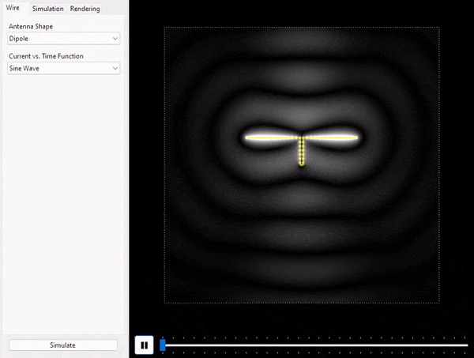
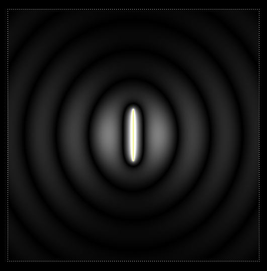
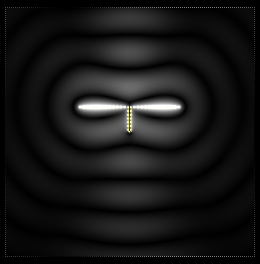
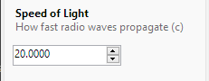
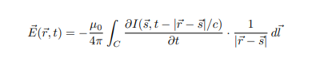

# Radio Waves Simulator

This program aims to simulate the propagation of radio waves from a thin 2-D wire of arbitrary shape. This project is not meant for exact or even useful solutions, and is rather more of an educational experiment.

### Download .exe
https://github.com/nreh/Radio-Waves-Simulator/releases/download/v1.0/Radio.Waves.Simulator.zip

&nbsp;



The bright spots in the simulation are the magnitude of the electric field at that point.





## Wire Shapes

The program comes with 3 default wire shapes:

 - Vertical line

 - Rectangle

 - Dipole

You can create your own by creating a text file in the `/Antenna Shapes` folder. Each line should contain a pair of coordinates indicating a point on the antenna shape.

## Current Functions

The current vs. time function describes the current running through the antenna over time. By default, two current functions are provided:

 - Sine Wave

 - Bell Curve

You can create your own current function by creating a text file in `/Current Functions`. The first line should contain the current function, and the second line should contain its derivative.

You can use something like https://www.derivative-calculator.net/ for help in calculating the derivative.

Expressions must be written so that they are parsable by the [Expressive](https://github.com/bijington/expressive) library. See their documentation or the included functions on how to write them.

Here's what the **Sine Wave** current function looks like:

```
Sin([t])
Cos([t])
```

### Tip

Rather than editing the Sin Wave equation to have higher frequency, you can mimic the behavior by decreasing the speed of light `c` in the **Simulation** tab.



## How it works



The above equation is used to simulate the electric field at all points around the wire. See this [Physics Exchange question for derivation](https://physics.stackexchange.com/questions/713477/is-my-derivation-of-the-electric-field-from-a-thin-wire-with-changing-current-co).

The intergral is solved numerically with the step defined by the variable `dp`. Therefore, the solution isn't exact but becomes more accurate as `dp` approaches 0.

## Known Issues & Concerns

- Performance leaves a lot to be desired. Because equations are parsed from text files using [Expressive](https://github.com/bijington/expressive), field calculations are slower than they could be if instead it were represented in code.

- Parameterizing wire shapes can be a bit buggy and result in clumping of points.

- The integral expression was derived by me and so I'm not sure if it's correct or complete. 

## Future Plans & Goals

- Utilize GPU to greatly speed up simulation.

- Cache current functions to improve performance.

- Allow in application editing of wires

- Allow multiple wires.

- Show vector field with arrows rather than a scalar field showing field intensity.

- Allow curves and more complex antenna shapes.